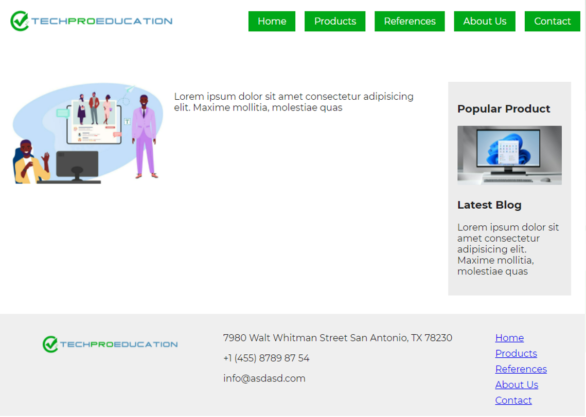
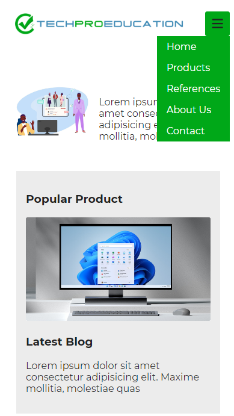

# Instructions  

Aşağıdaki şekilde bir responsive sayfa oluşturunuz

  ## Requirements
  1. Sayfa iskeleti flex stilleri kullanılarak yapılacaktır
  2. Gerekli görüntüler img klasörünün içinden alınacaktır
  3. Üst menü 768px genişliğinden küçük cihazlar için şekildeki gibi dropdown şekilde olacaktır
  4. Farklı boyutlardaki ekranlarda test edilerek içerik kaymalarının önüne geçilecektir.

  

### 768px genişlik ve üstü cihazlardaki sayfa görüntüsü

  
### 768px den daha düşük genişlikteki cihazlardaki sayfa görüntüsü

  