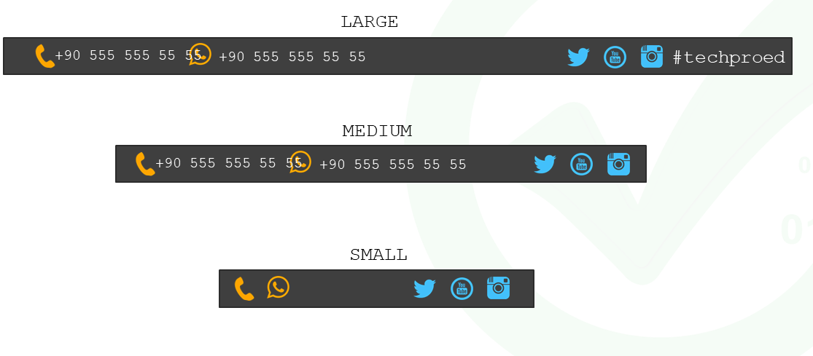

# Instructions  

  ** Bootstrap kullanarak görseldeki gibi responsive tasarım yapalım.

  ## Steps
  1. İkonlara ve #techproed yazısına tıklandığında ilgili yerlere yönlendirilecek
  2. İkonların rengi soldakiler farklı sağdakiler farklı olacak
  3. Large,medium ve small ekranlarda resimdeki gibi bir görünüm olacak

 

 

  

  
  
  