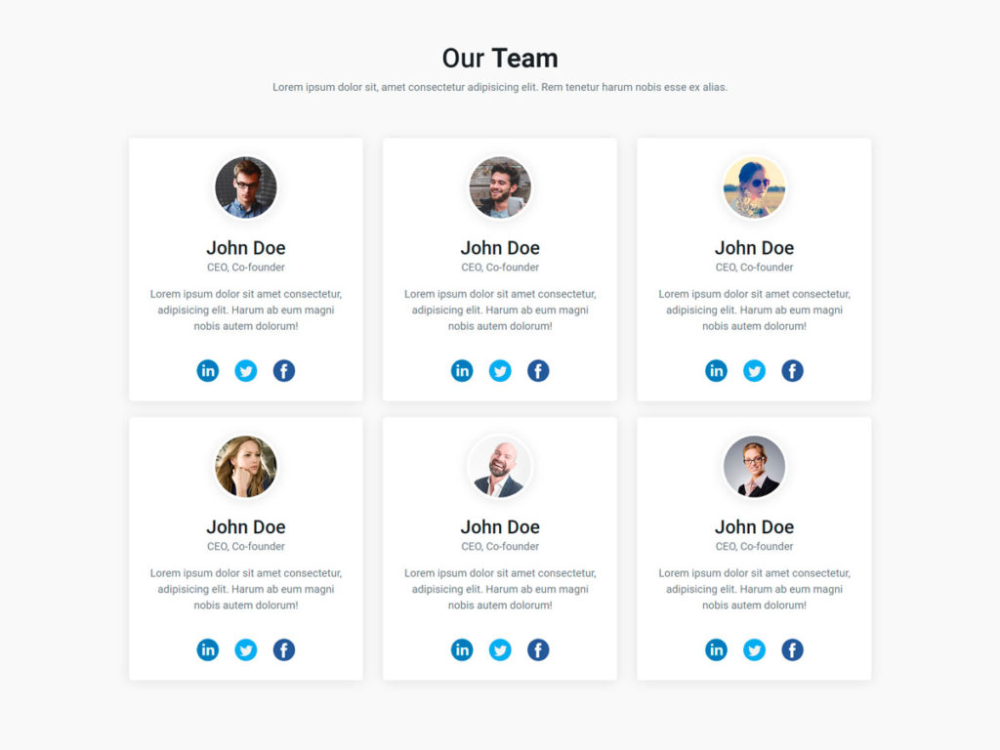

# Instructions  

Bootstrapin cardını kullanarak yandaki görüntüyü elde etmeye çalışın(Resimler farklı olabilir).

  ## Steps
  1. Grid yapısını kullanınız.
  2. En küçük ekranlarda bir aynı satırda 1 card, SM den itibaren 2 card, LG den itibaren 3 card gözükmeli
  3. Profile image ler için randomuser.me adresi kullanılabilir.
     (https://randomuser.me/api/portraits/women/1.jpg)
     1.jpg yerine 2.jpg, 3.jpg eklinde farklı kullanıclar kullanılaiblir.
  4. Social medi linkleri için fontawesome kullanaiblirsiniz

  

  

  
  
  