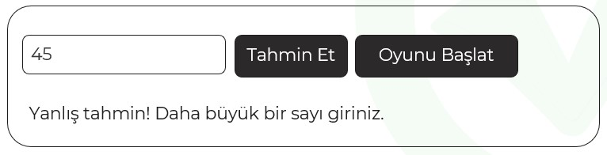

# Instructions  

** Aşağıdaki requirement lara göre bir uygulama hazırlayınız

  

  

  ## Requirements
  1. Görselde görüldüğü gibi bir tasarım yapınız
  2. Bootstrap kütüphanesinden faydalanabilirsiniz
  3. Sayfa yüklendiğinde sadece "Oyunu Başlat" butonu görülmeli. Bu butona tıklandığında Textbox ve "Tahmin Et" butonu gözükmeli. "Oyunu Başlat" butonu gizlenmeli
  4. Yapılan her tahminden sonra alt tarafta bir yönlendirici ifade görülmeli. Tahmin etmek için butona basılabildiği gibi textbox ta iken enter a basmak ta aynı işlevi sağlayabilmeli. Yönlendirici ifade sadece enter a veya butona basıldığında gözükmeli, kullanıcı textbox ta bir değişiklik yaptığında gizlenmeli.
  5. Eğer sayı doğru bilinirse uygun bir mesaj gösterilmeli ve sadece "oyunu başlat" butonu gözükür hale gelmeli.
  6. Kullanıcının toplam 10 hakkı olmalı. Doğru sayıyı 10 denemede bulamazsa tahmin yaptırmadan oyunu sonlandırmalı. KAybettiniz mesajı gözükmeli
  7. Hak sayısı parametreik olarak tek yerden değiştirilebilmeli

  
  ## Hints:
  - Rasgele sayı tutma formülü:
 `let sayi = Math.floor(Math.random() * (max - min + 1)) + min`

  - Elemenları gizleyip göstermek için bootstrap teki d-none class ı eklenip kaldırılabilir

  - Textbox ta enter tuşunu yakalamak için keyup event i içinde e.keyCode === 13 kontrolü yapılabilir.
  