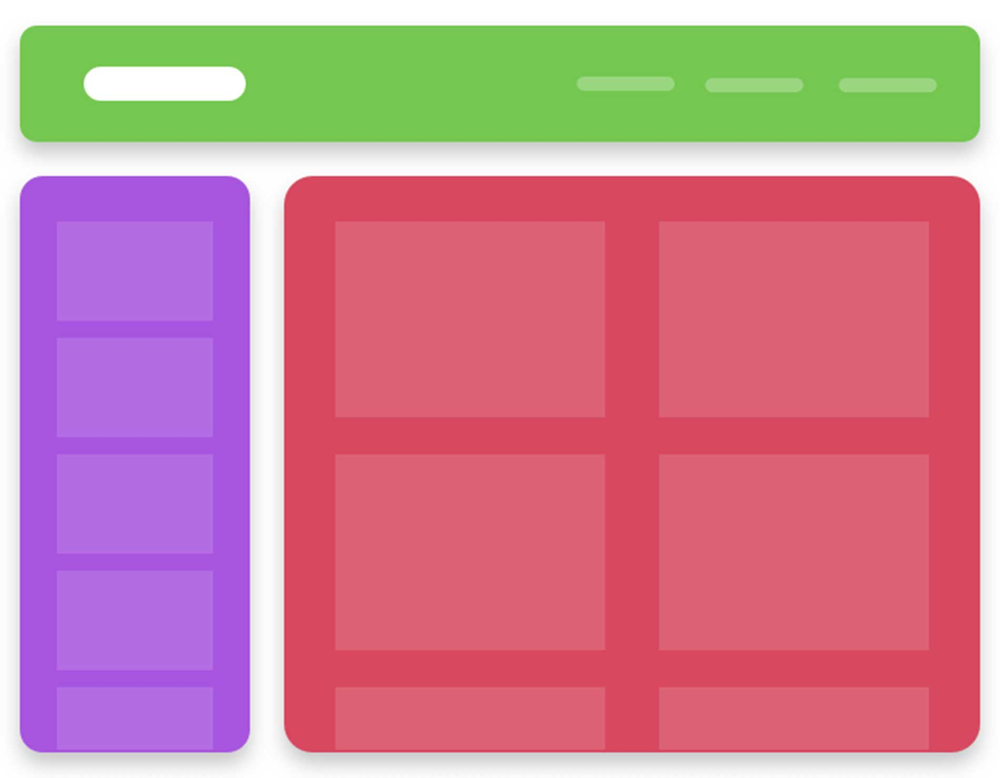

# Instructions  

** Şekildeki görseldeki gibi bir uygulama yapınız **

  

  

  ## Steps
  1. Header, Content ve SideBar isimli componentler oluşturunuz
  2. Bu componentler app component i içinde birleşmeliler