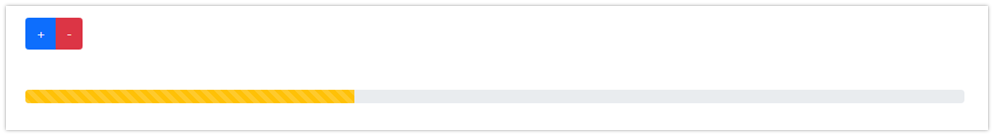

# Instructions  

** Aşağıdaki görüntüye benzer bir uygulama yapınız **

  

  

  ## Requirements
  1. (+) butonuna basıldığında Progress bar 10 birim dolacak

  2. (-) butonuna basıldığında 10 birim azalacak.

  3. 0 – 100 arasında değer alabilecek

  4. Anlık değerini de gösteriniz!

  5. Ayrı bir component olarak tasarlayıp App.js ye ekleyiniz