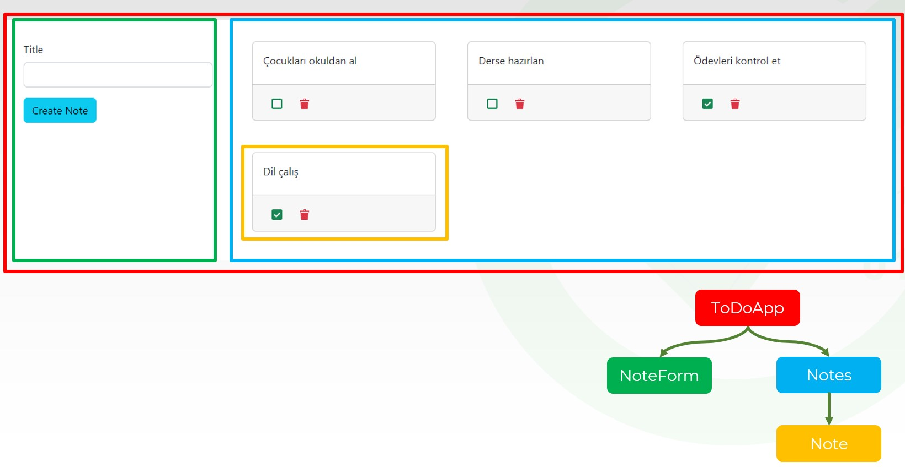

# Instructions  

** Aşağıdaki gibi bir todo list uygulaması yapınız **

  

  

  ## Steps
  1. Yukarıdaki görüntüde hangi componentleri oluşturacağınız renklerle ifade edilmiştir

  2. API olarak MockAPI kullanınız. Aşağıdaki field ları oluşturunuz:
  ```
    {
    id: Object,
    message: string,
    completed: Boolean
    }
  ```

  3. API de POST, PUT, DELETE, GET methodlarını oluşturunuz.
  
  4. Reactstrap, booststrap, react-icons ve axios kütüphanleri yüklenmiştir.
  
  5. Componentlerinizi replit te düzgün çalışabilmesi için component uzantılarını JS değil JSX yapınız
  
  6. NoteForm component inde başlık girilip Create Note butonuna basıldığında API ye post işlemi yapılacak dönen object notes component inde ilk sırada gösterilecek
  
  7. Her Note içinde iki buton olacak, yeşil buton completed değerini değiştirecek. Bunun için put methodunu kullanabilirsiniz. Silmek için kırmızı butona tıklanacak.  Bu da delete methodu ile API ye bağlanacak.
